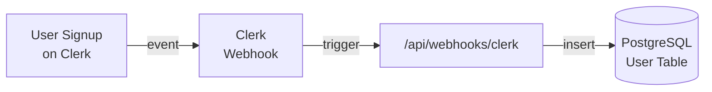

# Tailus Feedus

## New features

### UI

- Full responsive design tested on Smartphone, Laptop and PC
- New Categories Menu on Home page
- New Footer
- Single Meal modal
- Single Meal page on refresh (See NextJS section)
- All Meals page
- Cart page
- Authentication pages
- Toast notifications for key events

### Authentication

- Email and Password authentication using Clerk for seamless sign up and sign in process while ensuring proper validation.
- Implemented Clerk Webhooks to insert User information in our own Database for Cart table references.

### NextJS

- Implementation of SSR (Server side rendering) on Home page, Single product page and All products page ensuring fullpage SEO.
- Data fetching from NextJS server cache instead of third party api which is prone to rate limiting. Enhancing site speed by fetching populated HTML with data instead of fetching from client.
- Implementation of NextJS Modal on Single Meal page. Modal opens on click by default. But if you share the Meal link it will open in a separate page.
- Implementing Filter state using NextJS searchParams. Now you can share your searched Meals page with others.

### Cart

- Cart items saved in localStorage if user is not signed in
- Cart items saved in Posgresql Database if user is signed in
- Fully supports Add/Delete/Update functionality and persisting data in localStorage/Database

## Bug fixes

- MealDB Api rate limit fixed by Caching apis in server
- Fixed Fonts
- Fixed Searchbar functionality
- Fixed and enhanced Hero banner section responsive design on Mobile
- Navbar now closes on route change

## Time Estimate:

27 hours (average of 9 hours per day)

#### Additional Research and Implementation Time:

4 hours — initial attempts at implementing local authentication using NextAuth. Due to challenges with the documentation, I opted for Clerk Auth to meet the project deadline and ensure stability and efficiency.

## Clerk webhook diagram

